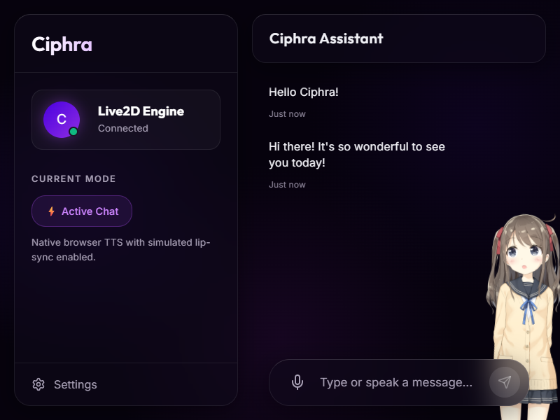

# Ciphra Assistant

A modern, premium React-based AI chat assistant featuring an interactive Live2D avatar, intelligent responses powered by Google's Gemini AI, and natural browser TTS with real-time lip-sync.



## ✨ Features

- **🎨 Premium UI:** A stunning "Deep Amethyst & Cosmic Indigo" theme utilizing glassmorphism panels, floating layouts, smooth bouncy animations, and an animated radial gradient mesh background.
- **🤖 Intelligent Chat:** Powered by the cutting-edge **Google Gemini API**, providing smart, context-aware responses and sentiment analysis.
- **👧 Live2D Cubism Integration:** Features a fully interactive 2D avatar (Hiyori) seamlessly integrated using PixiJS and `pixi-live2d-display`. She reacts to emotions and looks at your cursor!
- **🗣️ Natural Voice & Lip-Sync:** Uses advanced native browser TTS prioritized for realistic cloud voices (like Microsoft Aria and Google UK English Female). The Live2D avatar dynamically simulates lip-sync and head movements while speaking!

## 🛠️ Tech Stack

- **Frontend:** React 19, Vite, Vanilla CSS
- **Graphics & Avatar:** PixiJS (v7), `pixi-live2d-display`, Live2D Cubism 3/4
- **AI / LLM:** Google Gemini API (`@google/genai` or direct REST fallback)
- **Speech:** Native Web Speech API (`window.speechSynthesis`)

## 🚀 Getting Started

### Prerequisites
- Node.js (v18+ recommended)
- A Google Gemini API Key

### Installation

1. **Clone the repository** (if you haven't already):
   ```bash
   git clone https://github.com/Jatin-pardeshi/Ciphra.AI.git
   cd Ciphra
   ```

2. **Install dependencies:**
   ```bash
   npm install
   ```

3. **Configure your API Key:**
   Open `src/services/gemini.js` and insert your Gemini API Key in the `API_KEY` constant, or use an environment variable.

4. **Run the development server:**
   ```bash
   npm run dev
   ```

5. Open your browser and navigate to `http://localhost:5174`!

## 🔧 Scripts
- `npm run dev`: Starts the local development server.
- `npm run build`: Bundles the application for production.
- `npm run preview`: Previews the production build locally.
- `node test_frontend.cjs`: Runs an automated Puppeteer test to ensure the UI and Live2D engine are rendering correctly.
